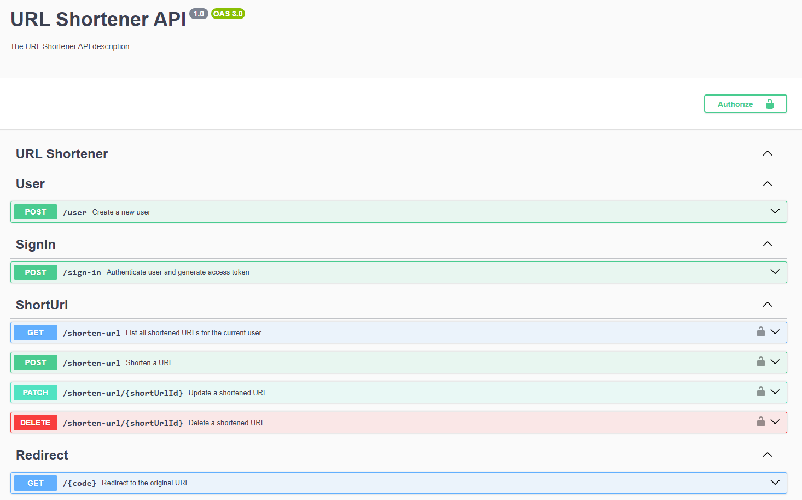
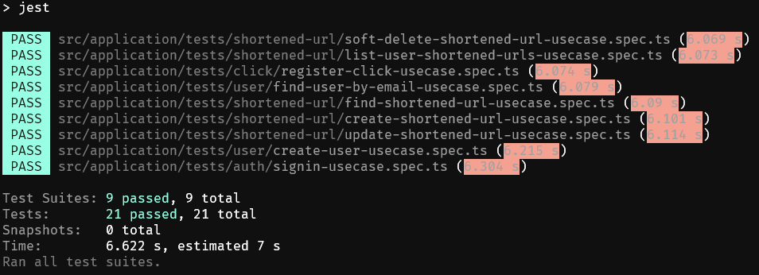

<p align="center">
    
</p>
<p align="center"><h1 align="center">URL SHORTENER</h1></p>
<p align="center">
	<em><code>❯ URL Shortener API built with NestJS and PostgreSQL</code></em>

   [🇺🇸 Read in English](README.md) | [🇧🇷 Leia em Português](README.pt-br.md)
</p>

## Built with
- Node.js
- TypeScript
- NestJS
- PostgreSQL
- TypeORM
- JWT
- Class Validator
- Docker
- Docker Compose
- Jest
- Swagger

## Requirements
- [Node.js](https://nodejs.org/en/download/) (v20.18.0 or higher)
- [Docker](https://docs.docker.com/get-docker/) 
- [Docker Compose](https://docs.docker.com/compose/install/)


## Deployed at: [url-shortener.raffp.dev](https://url-shortener.raffp.dev/api)


## Local Setup
1. Clone the repository
```sh
git clone https://github.com/rafaelpereira7l/url-shortener.git
```
2. Navigate to the project directory
```sh
cd url-shortener
```

3. Create a `.env` file in the root directory and copy the `.env.example` file
```sh
cp .env.example .env
```
4. Fill in the required environment variables in the `.env` file
```sh
NODE_ENV=DEVELOPMENT

BASE_URL=http://localhost:3000

JWT_SECRET=secret
JWT_EXPIRES_IN=7d

DB_HOST=localhost
DB_PORT=5432
DB_USER=postgres
DB_PASSWORD=postgres
DB_NAME=url_shortener
```


## Running the Application 
1. Install the project dependencies
```sh
pnpm install
```

2. Run the docker postgres container
```sh
docker-compose -f docker-compose.dev.yml up postgres -d
```
3. Start the development server
```sh
# Run the development server locally
pnpm run start:dev

# Alternatively, run the development server inside the Docker container
$ docker-compose -f docker-compose.dev.yml up --build
```
5. Run the unit tests
```sh
# Run unit tests locally
$ pnpm run test

# Alternatively, run unit tests inside the Docker container
$ docker exec -it url-shortener-app-dev pnpm run test
```
8. Open your browser and navigate to `http://localhost:3000/api` to access the API documentation in Swagger UI

## Application Architecture
The project follows the principles of **Clean Architecture**, which promotes the separation of responsibilities and independence of layers, dividing the application into well-defined layers such as **Entities (business rules)**, **Use Cases (application logic)**, **Controllers (user interface)**, and **Repositories (data access)**. This structure ensures that the core business logic is independent of frameworks, external libraries, or infrastructure details, facilitating maintenance, testing, and system evolution. For unit testing, **InMemory Repositories** are used, which simulate the behavior of real repositories in memory, allowing the application logic to be validated in an isolated and efficient manner without relying on databases or external infrastructure. Dependency inversion is applied to ensure that high-level layers (such as business rules) depend only on abstractions, not concrete implementations, reinforcing modularity and code testability.

## Screenshots 📷

<details>
  <summary>Swagger</summary>

  URL: http://localhost:3000/api

  
</details>

<details>
  <summary>Unit Tests</summary>
  
</details>

## Usage
### Endpoints
| Method | Endpoint | Description |
| --- | --- | --- |
| POST | `/user` | Create a new user |
| POST | `/sign-in` | Sign in a user |
| GET | `/{code}` | Access a shortened URL |
| GET | `/shorten-url` | List all shortened URLs with clicks count for the current user |
| POST | `/shorten-url` | Create a new shortened URL |
| PATCH | `/shorten-url/{id}` | Update a shortened URL |
| DELETE | `/shorten-url/{id}` | Delete a shortened URL |


### Authentication
The API uses JWT authentication. To authenticate, include the `Authorization` header in your request with the value `Bearer <token>`, where `<token>` is the JWT token obtained from the `/sign-in` endpoint.

Anyone can request to shorten a URL, and there is only one endpoint available for this purpose. However, if the user is authenticated, the system will register that the URL belongs to them.

Authenticated users can list, edit the destination address, and delete URLs shortened by them.


### Example Request
```sh
curl -X GET \
  http://localhost:3000/shorten-url \
  -H 'Authorization: Bearer <token>'
```


## Run tests

```bash
# Run unit tests locally
$ pnpm run test

# Alternatively, run unit tests inside the Docker container
$ docker exec -it url-shortener-app-dev pnpm run test
```

📌 **Project developed by** [**Rafael Pereira**](https://raffp.dev/) 🚀
